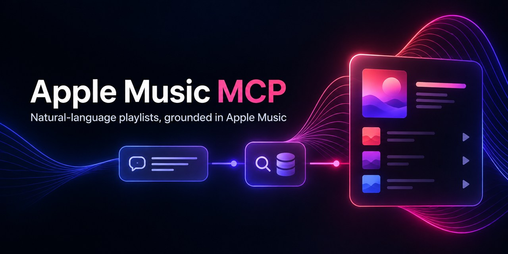

# Apple Music MCP 歌單策劃器



[English](README.md) | [简体中文](README_ZH_CN.md) | 繁體中文 |
[日本語](README_JP.md) | [한국어](README_KR.md) | [Español](README_ES.md) |
[Português do Brasil](README_PT_BR.md) | [Deutsch](README_DE.md) | [Français](README_FR.md)

**描述一種感覺、場景、年代、張力或敘事弧；MCP Agent 將它策劃成版本準確、起伏合理、
銜接自然，能從頭聽到尾的 Apple Music 歌單。**

主要入口是本機 `am-mcp` stdio 服務。MCP 客戶端既有的模型理解自然語言描述並挑選候選曲目；
本服務負責目錄搜尋、精確配對和帳號操作，不內建模型，也不需要另一組 LLM API key。
支援 Prompt 的客戶端可選 `create_playlist_from_description`，其他客戶端直接輸入描述即可。

需要 Python 3.10+，執行時只使用標準庫，支援 Windows / macOS / Linux。預設可自動取得
Apple 網頁播放器的公開 developer token，不必加入 Apple Developer Program。本專案不附帶
藝人清單、主題或現成歌單，曲目由你提供。

## 快速開始

```bash
git clone https://github.com/Z-Han-Z/apple-music-playlists.git
cd apple-music-playlists
python am_playlist.py status
python am_playlist.py login
python am_playlist.py create --name "我的歌單" --tracks "歌名 A - 藝人 X, 歌名 B - 藝人 Y"
```

也可安裝成全域命令：

```bash
pip install apple-music-playlists
am-playlist status
am-playlist login
```

安裝後有 `am-playlist` CLI 與 `am-mcp` MCP stdio 服務。開發模式可在儲存庫中執行
`pip install -e .`。

## 憑證與安全

首次執行會自動取得 developer token。存取個人音樂庫尚需一次 Apple ID 登入：

```bash
am-playlist login
```

可從 Windows Apple Music App 讀取、使用 Playwright 登入，或手動複製
`media-user-token`。完整步驟請參考 [SETUP.md](SETUP.md)（簡體中文）或
[SETUP.en.md](SETUP.en.md)（English）。請勿提交 `config.json`、`.p8`、收聽紀錄或產生的歌單。

## 主要功能

- 搜尋 Apple Music catalog，以曲名/藝人或 ISRC 精準配對。
- 建立、追加、查看與刪除歌單；大批操作可先 `dry_run`。
- 元資料體檢：藝人集中度、類型、年代、時長、重複曲目與疑似間奏。
- 音訊特徵體檢：BPM、調性、響度、能量、情緒、相鄰銜接與整體弧線。
- 模擬退火重排，可保留分組，支援六種敘事弧。
- 最近播放與 Apple Music Replay 播放次數排行。

```bash
am-playlist search "歌名 藝人"
am-playlist playlists
am-playlist create --name "歌單名" --tracks "歌名 - 藝人, ..."
python playlist_audit.py "歌單名"
python playlist_flow.py "歌單名"
python playlist_optimize.py list.json -o order.json --arc cinderella
```

## MCP、Agent 與容器

```json
{
  "mcpServers": {
    "applemusic": {
      "command": "am-mcp",
      "env": {"PYTHONIOENCODING": "utf-8"}
    }
  }
}
```

共 13 個 MCP 工具，包含 `am_resolve_candidates`：它將 LLM 提出的候選池批次對應到
Apple Music 真實資料、重複與版本標記，但不代替 LLM 評分主題。LLM 直接根據使用者的文字比較候選；
曲序優化只是可選的段內銜接工具。工具說明同時包含英文與中文，並標示只讀、寫入和破壞性操作。
Codex、Claude、Cursor、VS Code/Copilot、Gemini CLI、Windsurf、Docker、Cordis/DSH 與 Harness
的完整設定請見 [docs/client-setup.zh-CN.md](docs/client-setup.zh-CN.md)。

```bash
docker build -t apple-music-playlists:1.4.0 .
```

stdio 容器必須保留 `-i`、不可使用 `-d`。將應用專用憑證目錄掛載到
`/home/app/.config/am-playlist`，並保持可寫以便更新 token；緩存掛載到 `/home/app/.cache/am-playlist`。
不要把令牌寫入映像。

## 限制與測試

- 寫入前先執行 `am_status`；刪除前向使用者顯示目標，MCP 還要求 `confirm=true`。
- Apple 僅允許建立歌單的 API 用戶端繼續修改該歌單。
- 建立歌單會把曲目加進音樂庫；刪除歌單不會移除曲目。

```bash
python -m unittest discover -s tests -v
```

測試完全離線。更多策展方法、API 實測與變更請見 [`docs/`](docs/)、[`skill/`](skill/)
與 [CHANGELOG.md](CHANGELOG.md)。

MIT License。非 Apple 官方專案；請使用自己的 Apple Music 帳號並遵守 Apple 服務條款。
